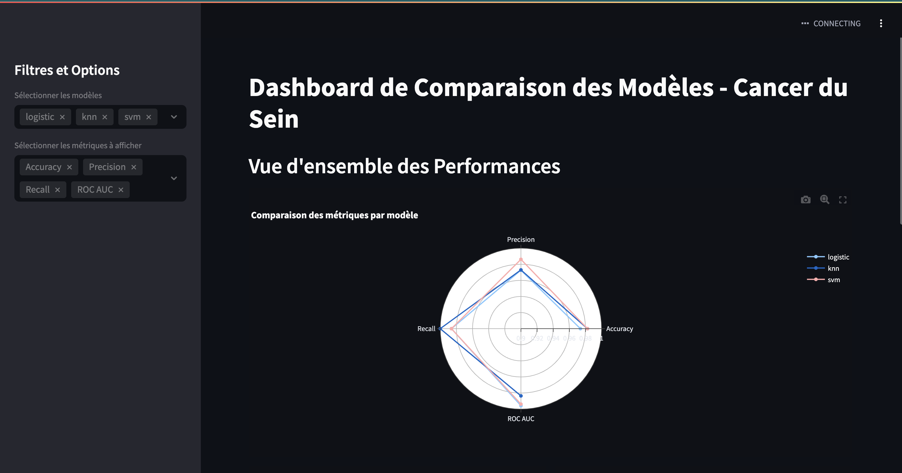
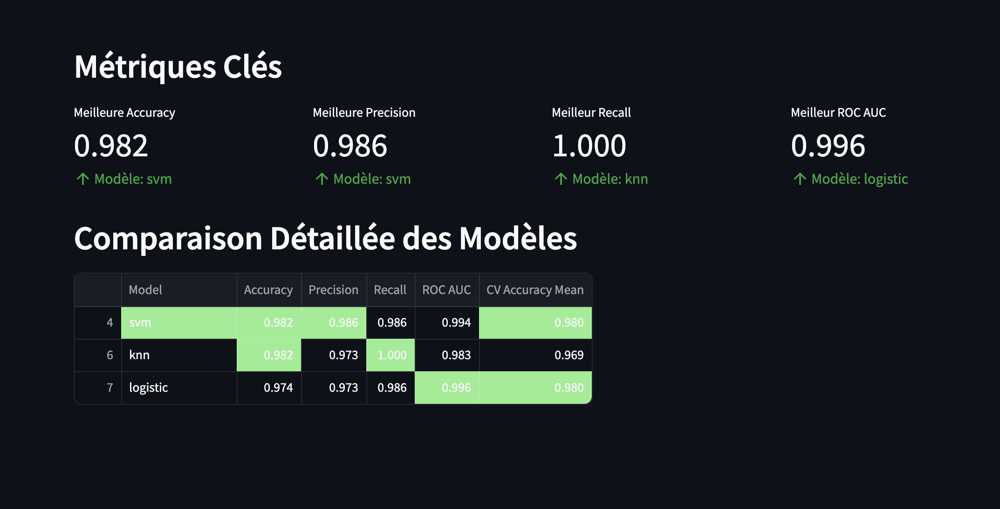
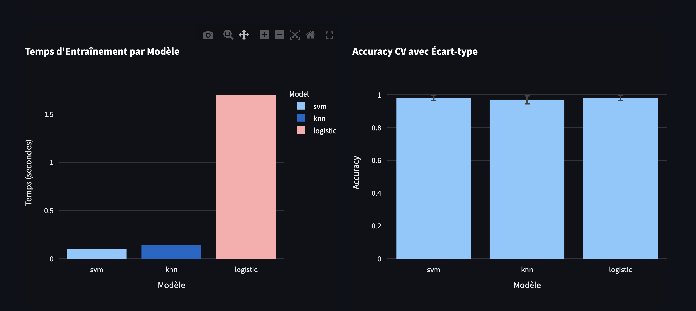

# Projet de Comparaison de Modèles pour le Cancer du Sein

## 📋 Vue d'ensemble
Ce projet implémente un pipeline complet d'apprentissage automatique pour la détection du cancer du sein, comparant différents algorithmes de classification en utilisant le dataset Wisconsin Breast Cancer. Le projet inclut l'entraînement des modèles, les tests, le suivi des performances avec MLflow, et un tableau de bord Streamlit pour visualiser les résultats.



## 🏗️ Structure du Projet
```
.
├── README.md
├── dashboard
│   ├── __init__.py
│   └── run_dashboard.py
├── data
├── models
│   ├── __init__.py
│   └── models_training.py
├── requirements.txt
└── tests
    ├── __init__.py
    └── test.py
```

## 🚀 Fonctionnalités
- Entraînement et comparaison de plusieurs modèles de classification :
  - Régression Logistique
  - K plus proches voisins (KNN)
  - Random Forest
  - Machine à vecteurs de support (SVM)
  - Gradient Boosting
  - AdaBoost
  - Arbre de décision
  - Naive Bayes

- Métriques d'évaluation complètes :
  - Précision (Accuracy)
  - Précision (Precision)
  - Rappel (Recall)
  - ROC AUC
  - Scores de validation croisée
  - Temps d'entraînement

- Intégration MLflow pour le suivi des expériences
- Tableau de bord Streamlit interactif
- Suite de tests complète avec unittest et pytest

## 🛠️ Installation

1. Cloner le dépôt :
```bash
git clone <url-du-dépôt>
cd breast-cancer-model-comparison
```

2. Créer et activer un environnement virtuel :
```bash
python -m venv venv
source venv/bin/activate  # Sous Windows : venv\Scripts\activate
```

3. Installer les dépendances :
```bash
pip install -r requirements.txt
```

## 💻 Utilisation

### Entraînement des Modèles
Pour entraîner tous les modèles et enregistrer les résultats dans MLflow :
```bash
python models/models_training.py
```

### Exécution des Tests
Lancer la suite de tests :
```bash
python -m pytest tests/test.py
```

### Lancement du Tableau de Bord
Démarrer le tableau de bord Streamlit :
```bash
streamlit run dashboard/run_dashboard.py
```

## 📊 Fonctionnalités du Tableau de Bord
Le tableau de bord Streamlit propose :
- Comparaison interactive des performances des modèles
- Graphiques radar pour la visualisation des métriques
- Comparaison des temps d'entraînement
- Analyse de la précision par validation croisée
- Affichage des métriques clés
- Tableau de comparaison détaillé avec mise en évidence





## 🧪 Tests
Le projet inclut des tests complets :
- Validation du chargement et prétraitement des données
- Vérification de la séparation train/test
- Test des configurations des modèles
- Validation du logging MLflow
- Analyse de l'importance des caractéristiques
- Vérifications de la prévention des fuites de données

## 📈 Intégration MLflow
Le projet utilise MLflow pour suivre :
- Les paramètres des modèles
- Les métriques de performance
- L'importance des caractéristiques
- Les artefacts des modèles
- Le temps d'entraînement
- Les résultats de validation croisée

## 🔧 Paramètres des Modèles
Chaque modèle est configuré avec un ensemble spécifique d'hyperparamètres pour la recherche sur grille :

### Régression Logistique
- C : [0.1, 1.0, 10.0]
- max_iter : [200]
- solver : ['lbfgs', 'liblinear']

### Random Forest
- n_estimators : [100, 200]
- max_depth : [10, 20, None]
- min_samples_split : [2, 5]

(Et similaire pour les autres modèles - voir models_training.py pour les configurations complètes)

## 📝 Traitement des Données
- Mise à l'échelle automatique des données avec StandardScaler
- Séparation train/test stratifiée (80/20)
- Analyse de l'importance des caractéristiques pour les modèles applicables

## ⚙️ Prérequis
- Python 3.8+
- scikit-learn
- MLflow
- Streamlit
- Plotly
- Pandas
- NumPy
- Pytest